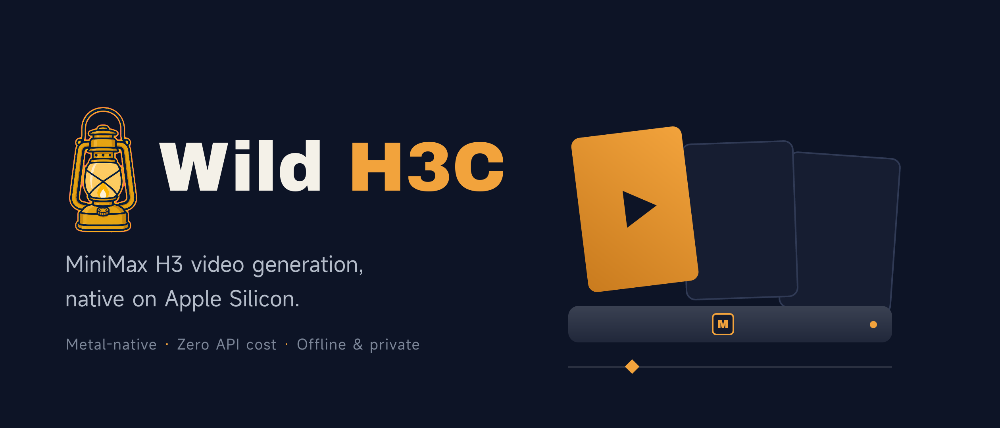

# Wild H3C — Apple Silicon 上的 MiniMax H3

在你的 Mac 上**本地运行 MiniMax H3 视频生成**，由
[h3.c](https://github.com/antirez/h3.c) Metal 引擎驱动——这是 Salvatore
Sanfilippo（antirez，Redis 作者）为 Apple Silicon 编写的 MiniMax H3 原生
C/Metal 移植。

> **[English README](README.md)**

## 为什么做这个插件

- **目前唯一能在 Mac 上实用地跑 MiniMax H3 的方案。** ComfyUI 内置的 H3 本地
  支持面向 NVIDIA CUDA；Apple Silicon 上走 PyTorch 路径慢到不可用（一个片段
  一小时以上）。h3.c 走 Metal，几十秒到几分钟出片。
- **零 API 费用。** 官方 MiniMax API 节点按秒计费；本地生成边际成本为零，
  prompt、seed、参考图随便试。
- **隐私与离线。** 素材不出本机。

插件本体是一层薄封装：以子进程方式调用你自己编译的 `h3` CLI，把进度喂给
ComfyUI 进度条，输出标准 ComfyUI `VIDEO`。

## 要求

- macOS + **Apple Silicon**（h3.c 走 Metal）
- ComfyUI ≥ 0.18（V3 节点 schema；在 0.37.0 上验证过）
- `PATH` 上有 `ffmpeg` 和 `ffprobe`（如 `brew install ffmpeg`）
- 自行编译的 `h3` 二进制（见下）
- MiniMax-H3 checkpoint，约 268 GB 磁盘（见下）

除 ComfyUI 自带依赖外无其他 Python 依赖。

## 安装

### 通过 ComfyUI Manager（发布到 Registry 之后）

在 ComfyUI Manager 里搜索 **Wild H3C** 安装。

### 手动

```bash
cd ComfyUI/custom_nodes
git clone https://github.com/skaiy/wild-h3c-comfyui.git
```

然后重启 ComfyUI。

## 第一步 —— 构建 h3.c 引擎

插件不分发引擎二进制，需从上游源码（MIT 协议）自行构建：

```bash
git clone https://github.com/antirez/h3.c.git
cd h3.c
make -j8
```

产出 `./h3` 可执行文件。整个 `h3.c` 目录要保留——二进制运行时会在自身所在
目录定位 `h3_shaders.metal`。

## 第二步 —— 获取模型

插件不分发、不代下模型。按你是否已经有 MiniMax-H3 权重，分两条路径。

### 路径 A —— 本地已有权重

比如之前玩 h3.c 时已经下载过。直接把插件指过去——`config.json` 里的
`model_dir`，或节点上的同名覆盖输入（见第三步）。h3 要求的目录结构：

```
MiniMax-H3/
├── model_index.json
├── FL2VA/      # 必需：文生视频 + 首尾帧锚定
│   ├── tokenizer/  text_encoder/  processor/
│   ├── transformer/  video_vae/  audio_vae/
│   └── model_index.json
└── Ref2VA/     # 仅 Reference to Video 节点需要
    └── （子目录同上）
```

每套 checkpoint 约 134 GB；只用文生视频的话**有 FL2VA 就够了**。

配置前可以先用 h3 自带的只读校验验证目录（秒级，只读文件头、不加载
权重）：

```bash
cd <path-to>/h3.c
./h3 --info -d <path-to>/MiniMax-H3
```

能正常打印 checkpoint 清单（Qwen3-VL encoder、FL2VA DiT、video VAE、
audio VAE……）就说明目录可用。

### 路径 B —— 新下载

checkpoint 在 Hugging Face：
[MiniMaxAI/MiniMax-H3](https://huggingface.co/MiniMaxAI/MiniMax-H3)
（合计约 268 GB；不需要参考生成功能的话可以只下 FL2VA）：

```bash
# 全量：
huggingface-cli download MiniMaxAI/MiniMax-H3 --local-dir <path-to>/MiniMax-H3

# 只下 FL2VA（约 134 GB）：
huggingface-cli download MiniMaxAI/MiniMax-H3 --include "FL2VA/*" "model_index.json" \
    --local-dir <path-to>/MiniMax-H3
```

如果你的网络访问 Hugging Face 不便：权重在 ModelScope 上也有镜像
（`MiniMax/MiniMax-H3`）；`huggingface-cli` 也支持通过 `HF_ENDPOINT`
走镜像（如 `HF_ENDPOINT=https://hf-mirror.com`）。部分 h3.c 检出还自带
支持断点续传的辅助脚本 `download-h3.sh`（用法 `./download-h3.sh
<文件列表> <目标目录> [并发数]`，基于 curl + hf-mirror，自动重试），
效果相同。

无论哪条路，下完都用路径 A 里的 `./h3 --info -d <目录>` 验证一遍。

> ### ⚠️ 模型许可证 —— 下载前必读
>
> MiniMax-H3 权重**不是**开源软件，受 **MiniMax H3 Community License
> Agreement** 约束——截至目前，该协议限制在部分地区的部署使用（据报道包括
> 美国、欧盟、英国、韩国），且生成内容**商用需购买商业许可**（Comfy 为官方
> 转售商）。
>
> 本插件代码是 MIT，但模型许可证完全独立。**请自行确认你所在地区与用途符合
> MiniMax H3 Community License 后再下载和使用权重。**

## 第三步 —— 配置路径

插件需要知道 `h3` 二进制和模型目录在哪。两种方式：

**方式 A —— `config.json`**（推荐）：编辑插件目录下的 `config.json`
（仓库里另附 `config.example.json`，是填好的示例）：

```json
{
  "h3_binary": "<path-to>/h3.c/h3",
  "model_dir": "<path-to>/h3.c/MiniMax-H3"
}
```

- `h3_binary` —— 第一步编译出的 `h3` 可执行文件路径。
- `model_dir` —— 第二步的 MiniMax-H3 目录（包含 `FL2VA/` 等子目录的那层，
  不是 `FL2VA` 本身）。

JSON 不支持注释，字段说明就写在这里；两个文件都请保持合法 JSON。

**方式 B —— 节点级覆盖**：每个节点都有 advanced 输入 `binary_path` /
`model_dir`。留空用 `config.json`，填了则按工作流覆盖。

两种都支持 `~` 展开。都没配时节点会立即报错并告诉你该配什么。

## 节点

### Wild H3 Text to Video

文生视频（FL2VA），可选首尾帧锚定。

| 输入 | 类型 | 说明 |
|---|---|---|
| `prompt` | STRING（多行） | 原始 H3 prompt |
| `width` / `height` | INT | 32 的倍数，面积 ≤ 768×1344；默认 864×480 |
| `seconds` | FLOAT | 0.25–15.0 秒，24 fps；h3 会把帧数向上对齐到 5+17n |
| `steps` | INT | 去噪步数；默认 20 |
| `preset` | COMBO | `precise`（50 层/reuse 1）、`balanced`（45/2）、`fast`（40/3） |
| `seed` | INT | 完整 64 位范围，支持 randomize |
| `token_reduction` | BOOL（advanced） | 中间 DiT 块视频 token 配对——激进提速 |
| `ssd_streaming` | BOOL（advanced） | BF16 DiT 权重从 SSD 流式读取 |
| `binary_path` / `model_dir` | STRING（advanced） | 节点级配置覆盖 |
| `first_frame` | IMAGE（可选） | FL2VA 首帧条件 |
| `last_frame` | IMAGE（可选） | FL2VA 尾帧条件 |

输出：**VIDEO**——直连内置 **Save Video** / **Preview Video** 节点。

### Wild H3 Reference to Video (Ref2VA)

参考条件生成。

| 输入 | 类型 | 说明 |
|---|---|---|
| *（上表所有公共输入）* | | |
| `ref_images` | IMAGE（可选，batch） | 最多 9 张有序参考图；prompt 里用 `<Picture 1>`、`<Picture 2>`…… 引用 |
| `ref_audio` | AUDIO（可选） | 一条 2–15 秒参考音频，用 `<Audio 1>` 引用；需至少一张参考图 |
| `ref_image_size` | COMBO（advanced） | `match` 或 `max` |

参考输入与首尾帧锚定互斥（首尾帧请用 Text to Video 节点）。

## 示例

1. 添加 **Wild H3 Text to Video**。
2. prompt：`A drone shot gliding over a misty pine forest at dawn, cinematic.`
3. 864×480，4 秒，20 步，preset 选 `balanced`。
4. `video` 接 **Save Video**，开跑。

首次运行有一次性模型加载成本（数十秒无进度条属正常）。M5 Max 上默认 20 步
一分钟内出片；`fast` preset + 少步数接近即时，适合快速迭代。

## 故障排查

| 症状 | 处理 |
|---|---|
| `h3 binary not found` | 先构建 h3.c（`make -j8`），并在 `config.json` 里指向 `h3` 可执行文件 |
| `model directory not found` | 下载 checkpoint，把 `model_dir` 指到包含它们的目录 |
| h3 报 `ffmpeg`/`ffprobe` 相关错误 | `brew install ffmpeg`，确保两者在 `PATH` 上 |
| 长时间无进度条 | 模型加载阶段（37 GiB checkpoint）不打印进度，等它加载完 |
| 旧工作流里节点失效 | 发布版节点 ID 已改为 `WildH3*`，重新拖一个节点即可 |

行为说明：

- **进度**：h3 往 stderr 打 `\r<阶段> 完成/总数`，插件解析后喂给 ComfyUI
  前端进度条。
- **取消**：ComfyUI 中断时 terminate → 5 秒 → kill 子进程。
- **并发**：全局锁串行化 h3 调用（单进程已占满 GPU）。
- **报错**：预检失败会列出具体违反的规则；h3 退出码非 0 时把 stderr 尾部
  原文抛出。

## 与官方 MiniMax API 节点的关系

互补而非竞争。把 Wild H3C 当作**本地迭代层**——prompt、构图、参考实验在 Mac
上免费即时。镜头定稿后，可选地把最终 prompt 交给官方 MiniMax API 节点
（ComfyUI 内置）跑 H3 Max、Context-IR 或云端 2K Regenerate 出成片。开放
checkpoint 里没有的能力，也仍然只有官方节点能提供。

## 支持这个项目

Wild H3C 免费开源（MIT）。如果它帮你省了 API 账单或工作室时间，可以赞助
开发：

- **爱发电**：[afdian.com/a/kaiyAI](https://afdian.com/a/kaiyAI)（微信/支付宝）
- 现阶段转发比赞助更值钱：一个 star、一次 X 转发、或者推荐给身边的 Mac 玩家，都是很大的支持。

## 致谢

- [antirez/h3.c](https://github.com/antirez/h3.c)——Salvatore Sanfilippo 的
  原生 C/Metal 移植，让这一切成为可能（MIT）。
- [MiniMax-AI/MiniMax-H3](https://huggingface.co/MiniMaxAI/MiniMax-H3)——模型
  及其 checkpoint（MiniMax H3 Community License）。

"Wild H3C" 是独立社区项目，与 MiniMax 无隶属或背书关系。文中提及
"MiniMax"、"H3" 仅为说明兼容性。

## 开发

测试套件在 `tests/`（已通过 `.comfyignore` 排除，不会打进 Registry 包）。
用 ComfyUI 自己的 Python 跑，除 `pytest` 外无额外依赖：

```bash
# 一次性安装：
/path/to/ComfyUI/.venv/bin/python -m pip install pytest

# 在仓库根目录：
/path/to/ComfyUI/.venv/bin/python -m pytest
```

- 单元测试（预检规则、命令拼接、配置解析、进度解析、取消语义）只依赖
  标准库 + pytest，秒级跑完。
- schema/加载测试会对照真实 ComfyUI 目录加载插件，默认写死了本机路径；
  用 `COMFYUI_ROOT` 环境变量指向你的 ComfyUI 根目录覆盖（找不到时这些
  测试会自动 skip）：

  ```bash
  COMFYUI_ROOT=/path/to/ComfyUI /path/to/ComfyUI/.venv/bin/python -m pytest
  ```

- `tests/manual_e2e.py` 是手动冒烟脚本：用最小参数（512×512、0.25 秒、
  4 步）真跑一次文生视频。不被 pytest 收集，需要本机有可用的 h3 二进制
  和模型，详见文件头注释。

## 发布流程（维护者用）

1. 在 [registry.comfy.org](https://registry.comfy.org) 注册并创建
   Publisher——PublisherId 创建后不可改，慎重命名。
2. 把 PublisherId 填进 `pyproject.toml` 的 `[tool.comfy] PublisherId`
   （替换 `YOUR_PUBLISHER_ID`）。
3. 在 publisher 页面生成 Registry Publishing API Key，加到本仓库 secret
   `REGISTRY_ACCESS_TOKEN`（Settings → Secrets and variables → Actions）。
4. 同页的 Variables 标签里把仓库变量 `REGISTRY_PUBLISH_ENABLED` 设为
   `true`——这是发布工作流的总开关。
5. 改 `pyproject.toml` 里的 `version` 并 push——只要 `pyproject.toml` 有变更，
   GitHub Action 就会自动发版。首次发布也可以在本地跑 `comfy node publish`。

## 许可证

插件代码：[MIT](LICENSE)。h3.c 引擎为 MIT（见其仓库）。MiniMax-H3 模型权重
受 MiniMax H3 Community License 约束——见上文警告。
